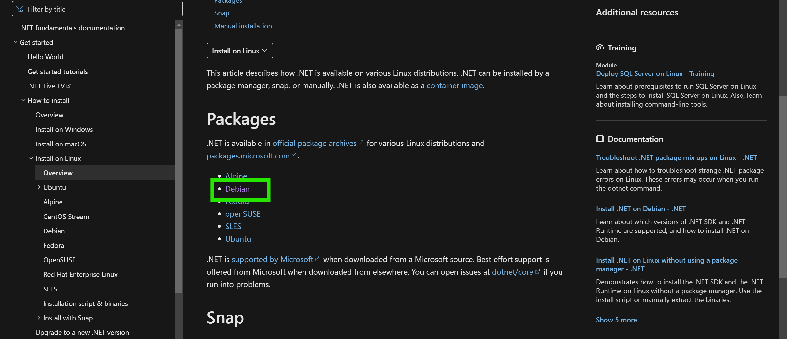
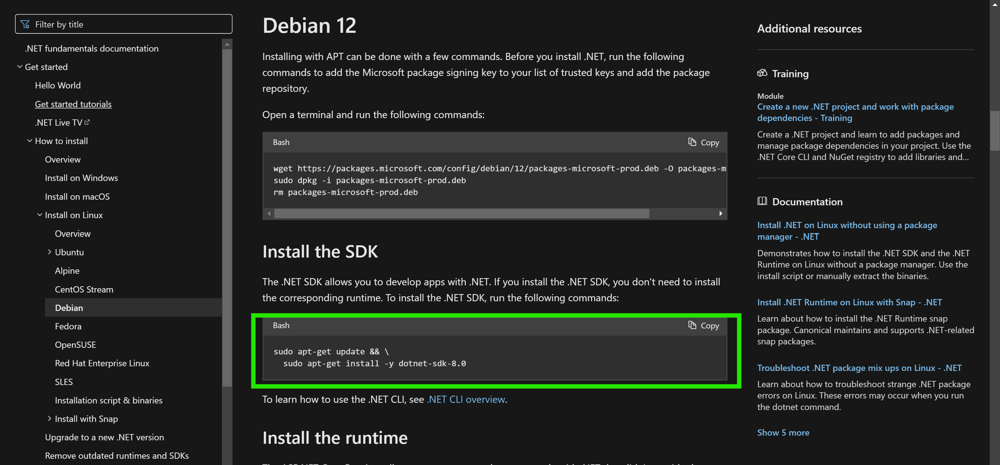
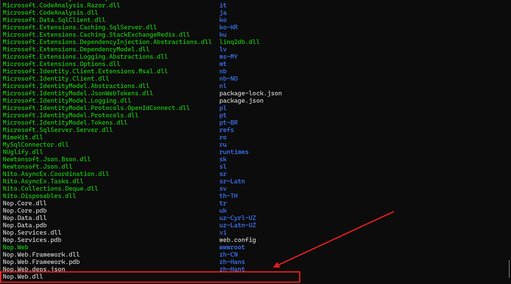
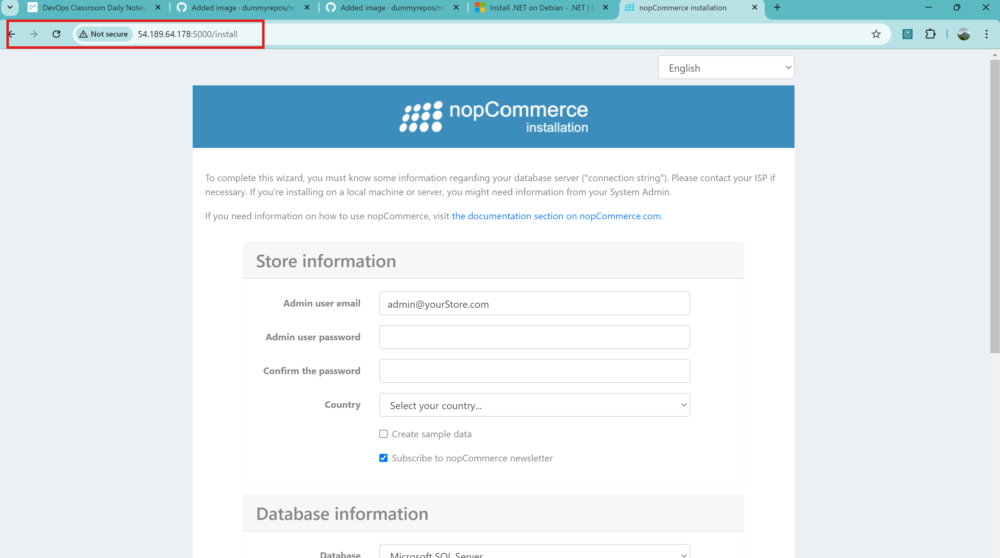
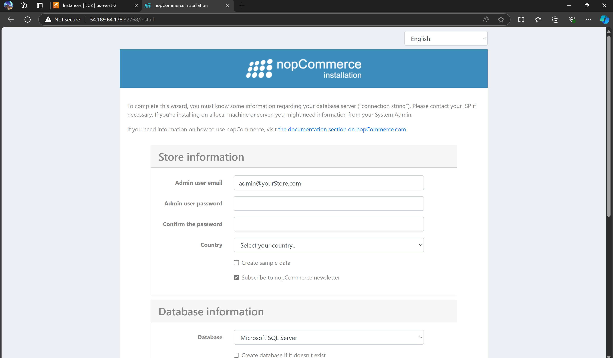

# Nop Commerce
* The way of running the application are of two types
  1. Manually
  2. Docker
## Requirements
  1. dotnet-sdk-8
     1. Nop.Web.csproj(Dependencies and configaration file)
  2. t2.medium instance
  3. docker

# Manually
## Requirements
  1. dotnet-sdk-8
  2. Nop.Web.csproj(requirements and configaration file)
  3. t2.medium instance
* First install dotnet sdk in your local system
* 
* 
* 
* Create a virtal machine `t2.medium` and install .net/sdk8
* Clone the git repository
```sh
# Install dotnet-sdk-8.0 in your machine and create published folder
sudo apt-get update && \
  sudo apt-get install -y dotnet-sdk-8.0
mkdir published
# Clone repository, move to the folder and build the application with the help of `Nop.Web.csproj` file
git clone https://github.com/konduriakhil/nopCommerce.git
cd nopproject
dotnet publish -c Release src/Presentation/Nop.Web/Nop.Web.csproj -o /home/ubuntu/published
# Go to homedirectory, go to published folder and make bin and logs folders
cd ~
cd published
mkdir bin logs
# Command to run the application
dotnet Nop.Web.dll --urls http://0.0.0.0:5000
```
* 
* 
* 
* 
* 
* 
* Now access the application through 5000 port like this
* 
# Dockerfile
## Requirements
  1. docker
  2. dotnet/sdk base image

## Docker Installation
```sh
# Docker Installation
curl -fsSL https://get.docker.com -o install-docker.sh
sh install-docker.sh
docker info
# Adding user to docker group
sudo usermod -aG docker ubuntu
exit
docker info
# Deleting the all containers
docker rm -f $(docker container ls -a -q)
# Deleting the all images
docker rmi $(docker image ls -q)
# Creating docker image
docker image build -t sp:1 .
# Creating containers
docker container run -d -P --name akhil sp:1
```
### Dockerfile
```Dockerfile
FROM mcr.microsoft.com/dotnet/sdk:8.0 AS build
LABEL evaluator="akhil"
USER nop
WORKDIR /nop
COPY . .
RUN mkdir /published && \
    dotnet publish -c Release src/Presentation/Nop.Web/Nop.Web.csproj -o /published && \
    cd /published && \
    mkdir bin logs;

FROM mcr.microsoft.com/dotnet/aspnet:8.0
LABEL authour="akhil"
ARG HOMEDIR="/com"
ARG USERNAME="com"
RUN adduser -h ${HOMEDIR} -s /bin/sh -D ${USERNAME}
USER ${USERNAME}
WORKDIR ${HOMEDIR}
COPY --from=build --chown=${USERNAME}:${USERNAME} /published/ .
EXPOSE 5000
CMD ["dotnet", "Nop.Web.dll", "--urls", "http://0.0.0.0:5000"]
```



### Trivy
* Install trivy on your machine to scan the docker image and to find vulnerabilities
```sh
# Installing trivy
sudo apt-get install -y wget
wget https://github.com/aquasecurity/trivy/releases/download/v0.34.0/trivy_0.34.0_Linux-64bit.deb
sudo dpkg -i trivy_0.34.0_Linux-64bit.deb
# Scanning the docker image
trivy image spc:1
```