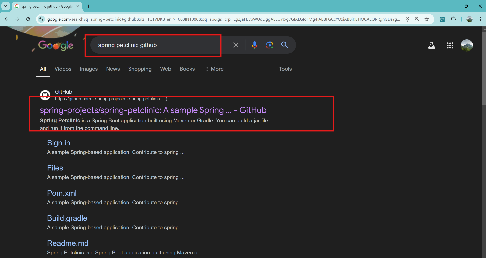

# Spring Petclinic
* Two ways of running the application 
  1. Manually
  2. Containerization 
## requirements
   1. java17
   2. Docker
   3. Trivy
   4. maven
      1. pom.xml(Dependencies and configaration file)


# Manual
## Requirements
  1. java17
  2. maven
  3. pom.xml
* Install the above said components on Instance which you take
```sh
# Installing necessary softwares
sudo apt update
sudo apt install openjdk-17-jdk -y
sudo apt install maven
java  --version
mvn -v
# Building the package
mvn clean package
# Command to run the application
java -jar target/*.jar
```
* After the building the code `target` folder got generated and in that folder .jar file or executable is stored
* 
* 
* 
# Docker
## Requirements
  1. Docker
  2. maven and java base image
  3. Trivy
## Docker Installation
```sh
# Docker Installation
curl -fsSL https://get.docker.com -o install-docker.sh
sh install-docker.sh
docker info
# Adding user to docker group
sudo usermod -aG docker azureuser
exit
docker info
# Deleting the all containers
docker rm -f $(docker container ls -a -q)
# Deleting the all images
docker rmi $(docker image ls -q)
# Creating docker image
docker image build -t sp:1 .
# Creating containers
docker container run -d -P --name akhil sp:1
```
### Dockerfile
```Dockerfile
FROM maven:3.9.7-eclipse-temurin-17 AS build
LABEL presentor='akhil'
WORKDIR /akhil
COPY . /akhil/
RUN mvn clean package
EXPOSE 8080

FROM amazoncorretto:17-alpine3.17
ARG HOMEDIR="/spc"
ARG USERNAME="spc"
WORKDIR ${HOMEDIR}
USER ${USERNAME}
RUN adduser -h ${HOMEDIR} -s /bin/sh -D ${USERNAME}
COPY --from=build --chown=${USERNAME}:${USERNAME} /akhil/target/spring-*.jar /akhil/spc.jar
CMD [ "java", "-jar", "spc.jar" ]
```
### Trivy
* Install trivy on your machine to scan the docker image and to find vulnerabilities
```sh
# Installing trivy
sudo apt-get install -y wget
wget https://github.com/aquasecurity/trivy/releases/download/v0.34.0/trivy_0.34.0_Linux-64bit.deb
sudo dpkg -i trivy_0.34.0_Linux-64bit.deb
# Scanning the docker image
trivy image spc:1
```