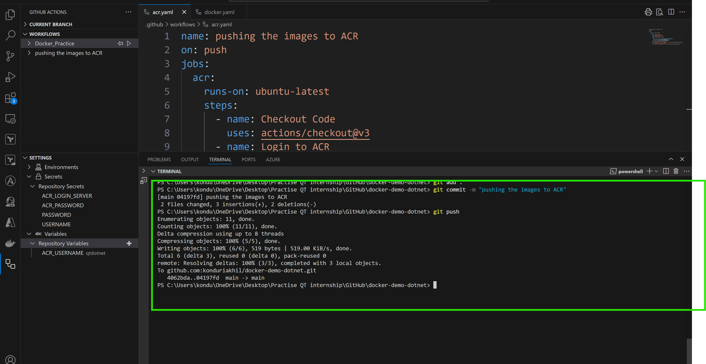

ACR Integration
-----------------
## Requirements
* [Ref here](https://github.com/marketplace/actions/azure-container-registry-login) for market place of acr login

* Create the ACR (Azure Container Registry) in the Azure Account

* Add the credentials as secrets as mentioned below
    1. login url 
    2. username
    3. password

* Use the following syntax for calling the variables `${{ vars.<variable_name>}}`, `${{ secrets.<secret_name> }}`

* See that whether images are pushed into the repository or not.
