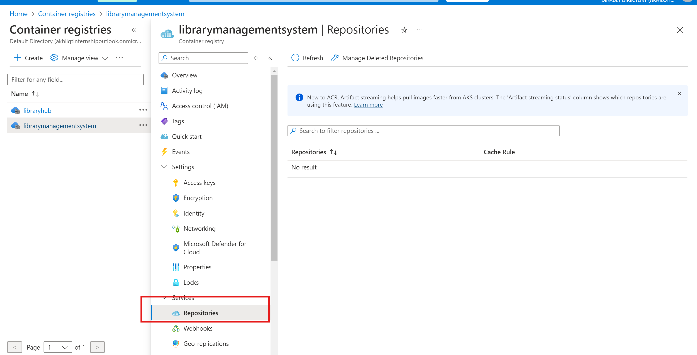
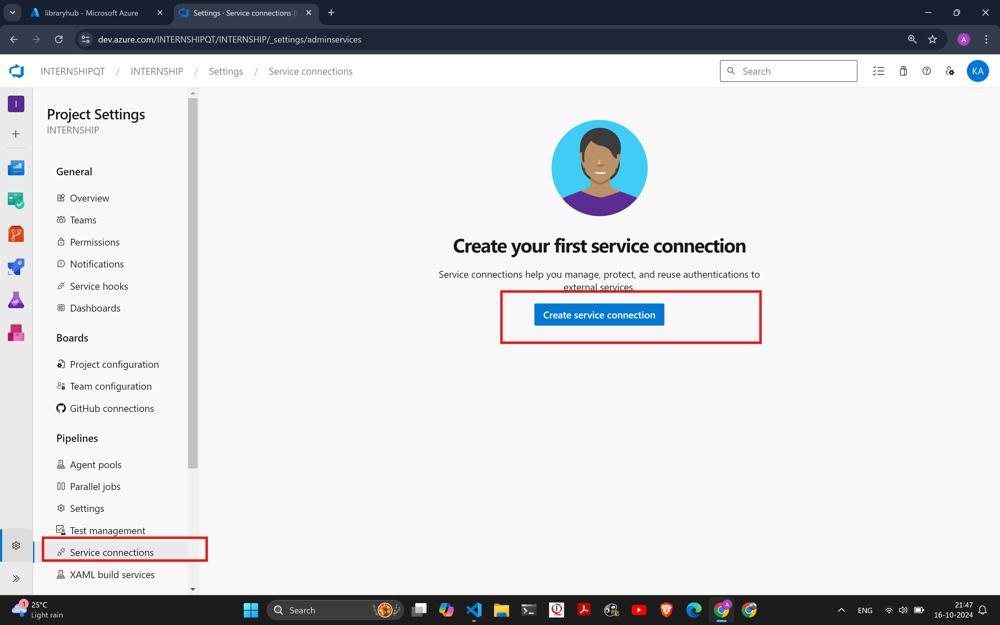
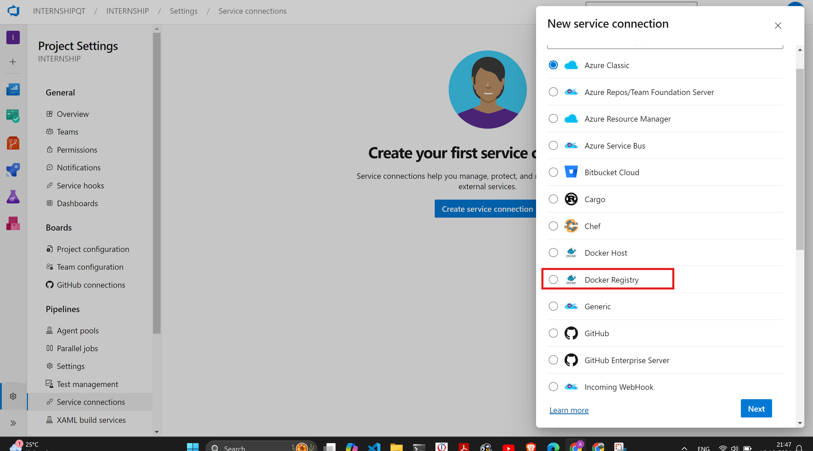
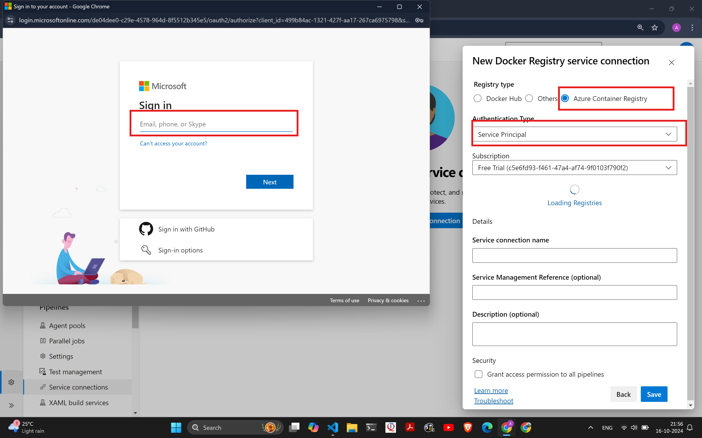
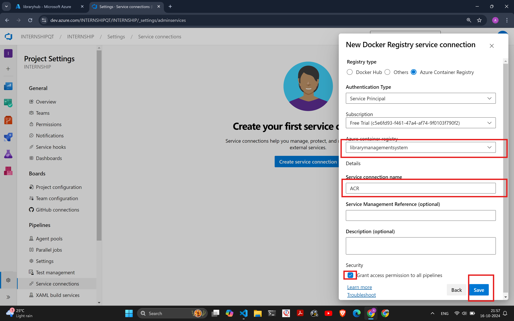
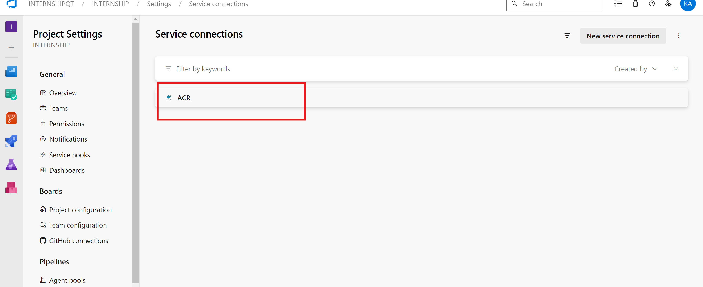
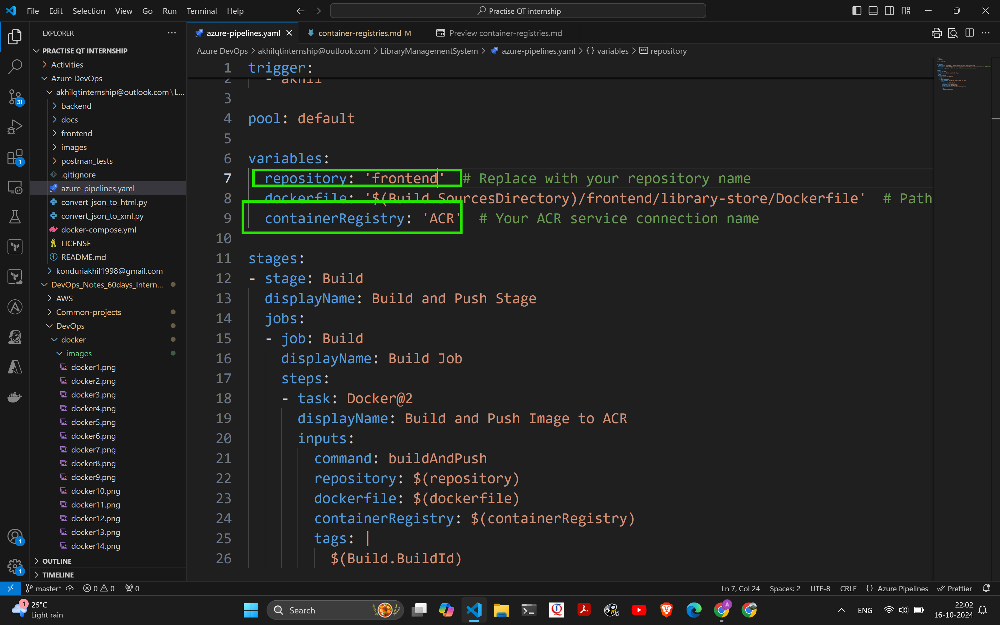
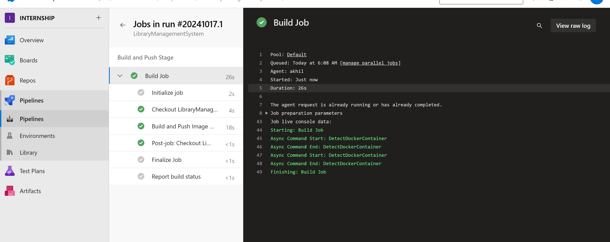
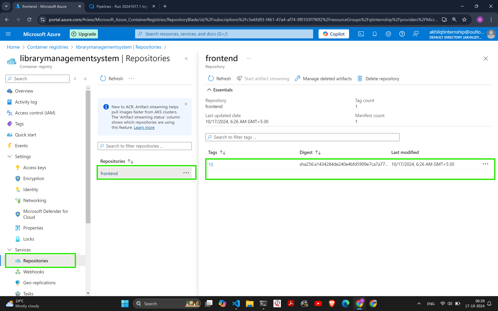

# Azure Container Registry
## Manual
* Login to Azure and follow the following images
* 
* 
* 
* 
* 
* 
```sh
docker login <Azure container registry url>
    USERNAME:
    PASSWORD: 
docker image tag nginx:latest <azure container registry url>/nginx:1
docker image ls
docker image push <azure container registry url>/nginx:1
```
* 
* 
* 
## Azure Pipeline
* Create Azure Container Registry from console login 
* 
### Azure Container Registry
* Create Azure Container Registry
* 
* 
* 
* Make service connecion in Azure DevOps project
* 
* 
* 
* 
* 
* 
* 
* 
# Docker Hub
* login to dockerhub
```sh
docker login -u <username>
    PASSWORD: Akhil@123
docker image ls
docker tag nginx:latest <username>/<repository_name>:1 
docker image ls
docker push <username>/<repository_name>:1
```


