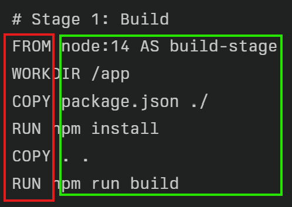
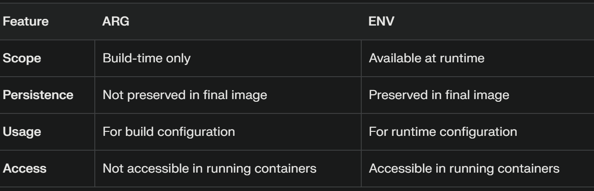
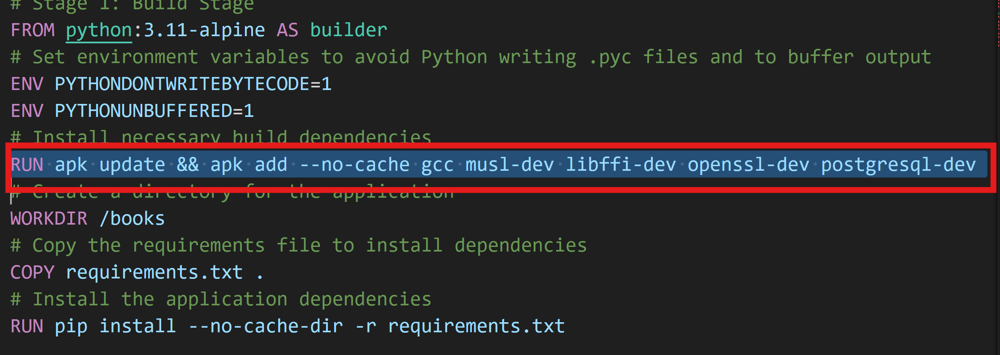

Docker Concepts
-----------------
# Docker installation
```sh
# Docker Installation
curl -fsSL https://get.docker.com -o install-docker.sh
sh install-docker.sh
docker info
# Adding user to docker group
sudo usermod -aG docker ubuntu
exit
docker info
# Deleting the all containers
docker rm -f $(docker container ls -a -q)
# Deleting the all images
docker rmi $(docker image ls -q)
# Creating docker image
docker image build -t sp:1 .
# Creating containers
docker container run -d -P --name akhil sp:1

```
# Dockerfile
* Docker is text based file
* First Column is called `instructions`, in the second cloumn we give `argument`
    * Generic Syntax is INSTRUCTION arguments for eg FROM alpine or RUN echo 'Hello'

* VAR is build time variable
* ENV is runtime variable

## Running the application manually by the reference of Dockerfile
* In Dockerfile we see commands like this

  ### Alpine Package Keeper
  * APK is used to manage software packages within Alpine Linux. It allows you to install, update, and remove packages.
  In Dockerfiles, you often see commands like RUN apk add --no-cache <package> to install necessary software packages without caching the package index, which helps keep the image size small.
  * For ubuntu we have package manager called `apt-Advanced Package Tool`
  ### How image layers are operated
  **Docker images provide a foundation for running containers.** When a container is created from an image, the image's layers are used as a base to create a writable filesystem within the container. This filesystem is initially based on the image's layers, but any changes you make within the container (e.g., creating files, modifying existing files) are stored in a separate writable layer.

**Here's how Docker images help when a container is running:**

1. **Base Environment:** The image's layers provide the base environment for the container, including the operating system, pre-installed software, and configuration settings.
2. **Consistent Environment:** Using the same image for multiple containers ensures a consistent environment, making it easier to manage and troubleshoot applications.
3. **Efficiency:** The layered structure of images allows Docker to efficiently transfer and manage images. Only the changed layers need to be transferred when sharing or distributing images.
4. **Isolation:** Containers are isolated from each other, preventing conflicts and ensuring that each container has its own dedicated environment.
5. **Portability:** Docker images can be easily moved and deployed across different environments, making it easier to develop, test, and deploy applications.

**In summary, Docker images provide a foundation for running containers by defining the base environment, ensuring consistency, improving efficiency, providing isolation, and enabling portability.**

# What is the difference between `bind mounts` and  `tmpfs mounts`?
**Bind mounts** and **tmpfs mounts** are two different mechanisms used in Docker to mount storage within containers. Let's explore their key differences:

**Bind Mounts:**

* **Nature:** Bind mounts directly map a directory on the host machine to a directory within the container.
* **Persistence:** Data changes made within the mounted directory in the container are directly reflected on the host machine.
* **Performance:** Typically faster than tmpfs mounts due to direct access to the host's file system.
* **Use Cases:**
   - Sharing data between the host and container.
   - Accessing files and directories on the host machine from within the container.
   - Persisting data beyond the container's lifecycle.

**Tmpfs Mounts:**

* **Nature:** Tmpfs mounts create a temporary file system in memory.
* **Persistence:** Data stored in a tmpfs mount is lost when the container is stopped or the host system is restarted.
* **Performance:** Generally faster than bind mounts due to the in-memory nature of the file system.
* **Use Cases:**
   - Storing temporary data that doesn't need to be persisted.
   - Improving performance for applications that require frequent file access.
   - Isolating data from the host file system for security or performance reasons.

**Key Differences Summarized:**

| Feature | Bind Mounts | Tmpfs Mounts |
|---|---|---|
| Storage Location | Host machine | In-memory |
| Persistence | Persistent | Temporary |
| Performance | Generally faster | Generally faster |
| Use Cases | Sharing data, persistence | Temporary data, performance |

**Choosing the Right Mount Type:**

* **If you need to persist data beyond the container's lifecycle,** use a bind mount.
* **If you need a high-performance, temporary file system,** use a tmpfs mount.
* **If you want to isolate data from the host file system for security or performance reasons,** use a tmpfs mount.

By understanding the differences between bind mounts and tmpfs mounts, you can select the appropriate mount type for your specific use case and optimize your Docker container's performance and data management.

