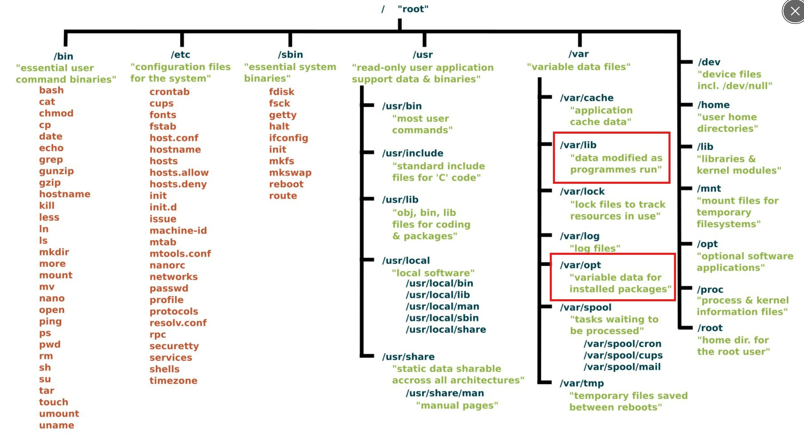

# Dockerfile
## Volumes
### Manual
* Docker volumes stored place
* 
* [volume_documentation](https://docs.docker.com/reference/dockerfile/#notes-about-specifying-volumes)
```sh
docker run --name lib-db -d -e 'POSTGRES_PASSWORD=password' -e 'POSTGRES_USER=lt' -e 'POSTGRES_DB=library' -v lib-vol:/var/lib/postgresql/data postgres:17
```
**In the Docker command, we are mentioning an already created volume.**

The `-v lib-vol:/var/lib/postgresql/data` option specifies that a volume named "lib-vol" should be mounted to the `/var/lib/postgresql/data` directory within the container. This implies that the volume "lib-vol" must exist prior to running the Docker command.

If the volume "lib-vol" does not exist, Docker will return an error indicating that the volume could not be found. To create the volume before running the Docker command, you can use the following command
```sh
docker volume create lib-vol
```
### Dockerfile
```Dockerfile
FROM ubuntu
RUN mkdir /myvol
RUN echo "hello world" > /myvol/greeting
VOLUME /myvol
```
* Here volume is created auto matically in the host machine and there is no any manual creation required
* 
