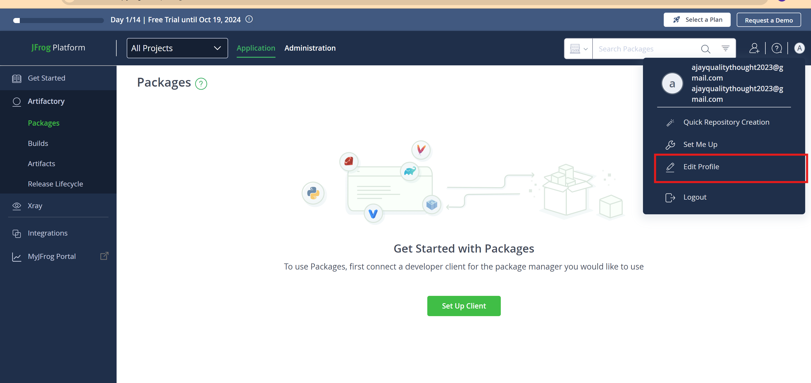

Jfrog Artifact Repository
--------------------------
* Jfrog is private artifact repository to store binaries, build files, artifacts, docker images.
* Jfrog provides 3 types of services
    1. Local repositories
       1. This stores the artifacts which we have built
    2. Remote repositories
       1. This stores the third party libraries and artifacts of open source
    3. Virtual repositories
       1. This is the combination of local repo and remote repo as logical whole
* It provides free trail version for 14 days
* 
* 
* 
* Write the domain which you want for the instance
* 
* login to the jfrog
## Create the new project
* 
* Give the project name, password and necessary credentials required to create the project
* 
* See whether project is created or not.
* 
## Create the new repository
* Create the new repository through the following ways
* 
* 
* select the type of artifact which you are going to build, docker for docker images
* 
* 
## Push the images to Jfrog from our system
* 
* 
* 
* 
* Tocken is generated, copy it because of security purpose it is not shown again
* 
* 
* 
### Giving connection to Jfrog
```sh
docker login <account url>
docker login https://akhilinternship.io/
Username: ajayqualitythought2023@gamil.com
# Password: <enter password>
```
* 
```sh
docker image ls
docker image tag nginx:latest akhilinternship.io/library-docker/spc:1.0
docker push akhilinternship.io/library-docker/spc:1.0
```
* 
* 
* 
* 
* 
* 