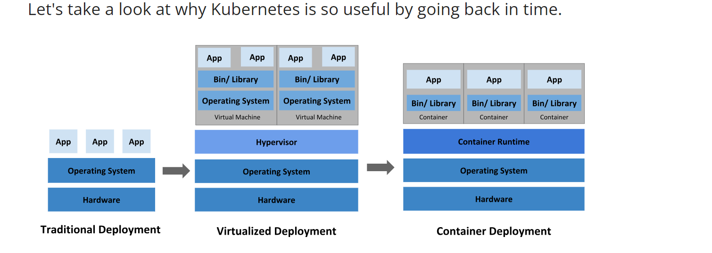

Kubernetes
----------------
# Concepts
* Kubernetes etomological meaning is Piolet from greek language
* 
* Historical context for Kubernetes

# K8s spec
* you have to set this when you create the object, providing a description of the characteristics you want the resource to have: its desired state.
* Tools such as kubectl convert the information from a manifest into JSON or another supported serialization format when making the API request over HTTP.
# Pod
* A Pod is similar to a set of containers with shared namespaces and shared filesystem volumes.
* Usually you don't need to create Pods directly, even singleton Pods. Instead, create them using workload resources such as Deployment or Job. If your Pods need to track state, consider the StatefulSet resource.
*  For example, if a Node fails, a controller notices that Pods on that Node have stopped working and creates a replacement Pod. The scheduler places the replacement Pod onto a healthy Node
*  