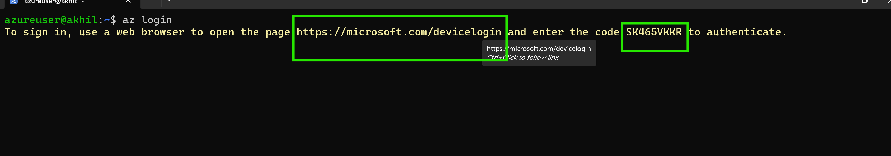
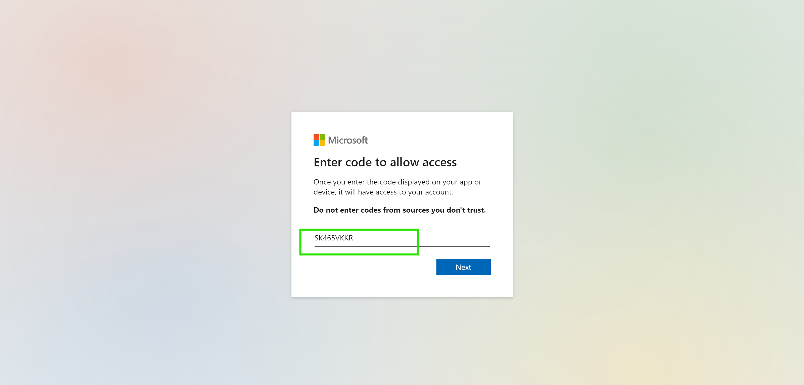

# Kubeadm Setup
[refer_here](https://directdevops.blog/2024/06/11/devops-classroom-notes-11-june-2024/) for kubeadm installation steps
```sh
# Installing docker on all nodes
curl -fsSL https://get.docker.com -o install-docker.sh
sh install-docker.sh
sudo usermod -aG docker azureuser
exit

# Install kubeadm, kubectl and kubelet on 3 nodes 
sudo apt-get update
sudo apt-get install -y apt-transport-https ca-certificates curl gpg
curl -fsSL https://pkgs.k8s.io/core:/stable:/v1.30/deb/Release.key | sudo gpg --dearmor -o /etc/apt/keyrings/kubernetes-apt-keyring.gpg
echo 'deb [signed-by=/etc/apt/keyrings/kubernetes-apt-keyring.gpg] https://pkgs.k8s.io/core:/stable:/v1.30/deb/ /' | sudo tee /etc/apt/sources.list.d/kubernetes.list
sudo apt-get update
sudo apt-get install -y kubelet kubeadm kubectl
sudo apt-mark hold kubelet kubeadm kubectl

# Configuring cri-runtime on all nodes
wget https://github.com/Mirantis/cri-dockerd/releases/download/v0.3.14/cri-dockerd_0.3.14.3-0.ubuntu-jammy_amd64.deb
sudo dpkg -i cri-dockerd_0.3.14.3-0.ubuntu-jammy_amd64.deb

#  Execute the following on master node, Lets initialize the cluster using the following command as a root user
kubeadm init --cri-socket unix:///var/run/cri-dockerd.sock

# When executed this command will give the output as shown below
Your Kubernetes control-plane has initialized successfully!
## To start using your cluster, you need to run the following as a regular user on master node:
  mkdir -p $HOME/.kube
  sudo cp -i /etc/kubernetes/admin.conf $HOME/.kube/config
  sudo chown $(id -u):$(id -g) $HOME/.kube/config
# Alternatively, if you are the root user, you can run:
  export KUBECONFIG=/etc/kubernetes/admin.conf
You should now deploy a pod network to the cluster.
Run "kubectl apply -f [podnetwork].yaml" with one of the options listed at:
  https://kubernetes.io/docs/concepts/cluster-administration/addons/
## Then you can join any number of worker nodes by running the following on each as root:
kubeadm join 10.0.0.4:6443 --token l6r787.27rpwz58au2gsmdn

# Configuring CNI for network on master node
kubectl apply -f https://github.com/weaveworks/weave/releases/download/v2.8.1/weave-daemonset-k8s.yaml

```
# AKS Installation
## CLI 
### Windows
```sh
# Installing azure-cli
choco install azure-cli

# Login to Azure account
az login
  EMAILID:
  PASSWORD: 
```
### Linux
```sh
# Update package lists and install prerequisites:
sudo apt-get update
sudo apt-get install apt-transport-https ca-certificates curl gnupg lsb-release

# Download the Microsoft signing key:
mkdir -p /etc/apt/keyrings
curl -sL https://packages.microsoft.com/keys/microsoft.asc | gpg --dearmor | sudo tee /etc/apt/keyrings/microsoft.gpg > /dev/null

# Add the Azure CLI repository:
SUITE=$(lsb_release -cs)
echo "deb [arch=amd64 signed-by=/etc/apt/keyrings/microsoft.gpg] https://packages.microsoft.com/repos/azure-cli/ $SUITE main" | sudo tee /etc/apt/sources.list.d/microsoft.list

# Install the Azure CLI:
sudo apt-get update && sudo apt-get install -y azure-cli

# Login to azure
az login
```


#### Creating AKS cluster
```sh
# Create new resource group
az group create --name akscentralindia --location centralindia
az group create --name kompose --location southindia

# This is one time setup, Register for Microsoft conatainer service
az provider register --namespace Microsoft.ContainerService

# Creating AKS cluster
az aks create --resource-group akscentralindia --name MyAKSCluster --node-count 1 --generate-ssh-keys --node-vm-size Standard_D2s_v3
az aks create --resource-group kompose --name kompose --node-count 1 --generate-ssh-keys --node-vm-size Standard_D2s_v3

# Installing kubectl in local system and configuring with aks master 
az aks install-cli
az aks get-credentials --resource-group akscentralindia --name MyAKSCluster

# Deleting AKS cluster
az aks delete --resource-group kompose --name kompose --no-wait --yes
```

## Terraform

```sh
terraform {
  required_providers {
    azurerm = {
      source  = "hashicorp/azurerm"
      version = "3.97.1"
    }
  }
}

provider "azurerm" {
  features {}
}
resource "azurerm_resource_group" "aks" {
  name     = "akhlirg"
  location = "centralindia"
}

resource "azurerm_kubernetes_cluster" "aks" {
  name                = "firstcluster"
  location            = azurerm_resource_group.aks.location
  resource_group_name = azurerm_resource_group.aks.name
  dns_prefix          = "myaks"

  default_node_pool {
    name       = "default"
    node_count = 1
    vm_size    = "Standard_D2s_v3"
  }

  identity {
    type = "SystemAssigned"
  }
}
```