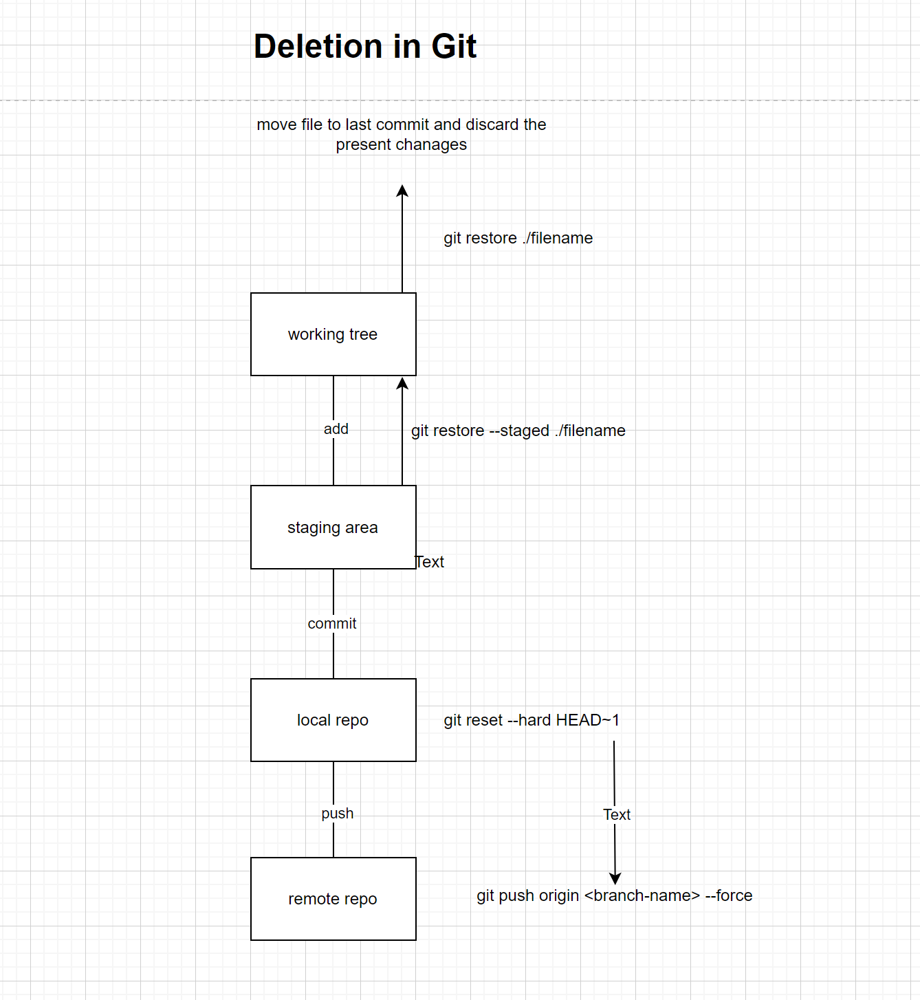
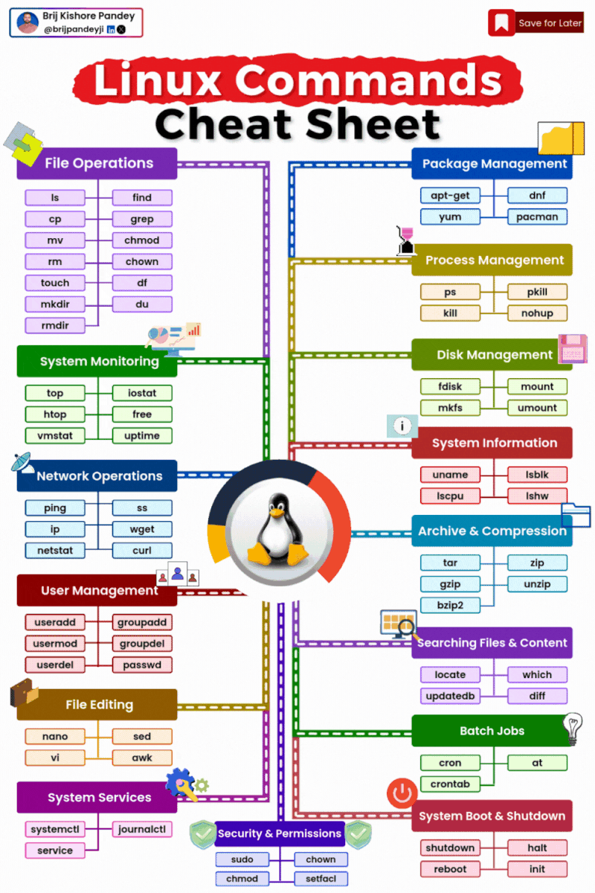

Deletion sections in git
--------------------------
* 
* 

### git push -u origin main

**If you use `git push -u origin akhil`, you're setting up a tracking relationship between your local `akhil` branch and the remote `akhil` branch on the `origin` remote repository.**

This means that Git will automatically know which branches to push and pull from when you use the `git push` command.

Here's a breakdown of what each part of the command does:

* **`git push`:** This is the basic command for pushing commits to a remote repository.
* **`-u`:** This flag sets up tracking between the local and remote branches.
* **`origin`:** This is the name of the remote repository you're pushing to.
* **`akhil`:** This is the name of the local and remote branch you're setting up tracking for.

**Once you've used this command, you can simply use `git push` to push your changes to the remote `akhil` branch without specifying branches.**
