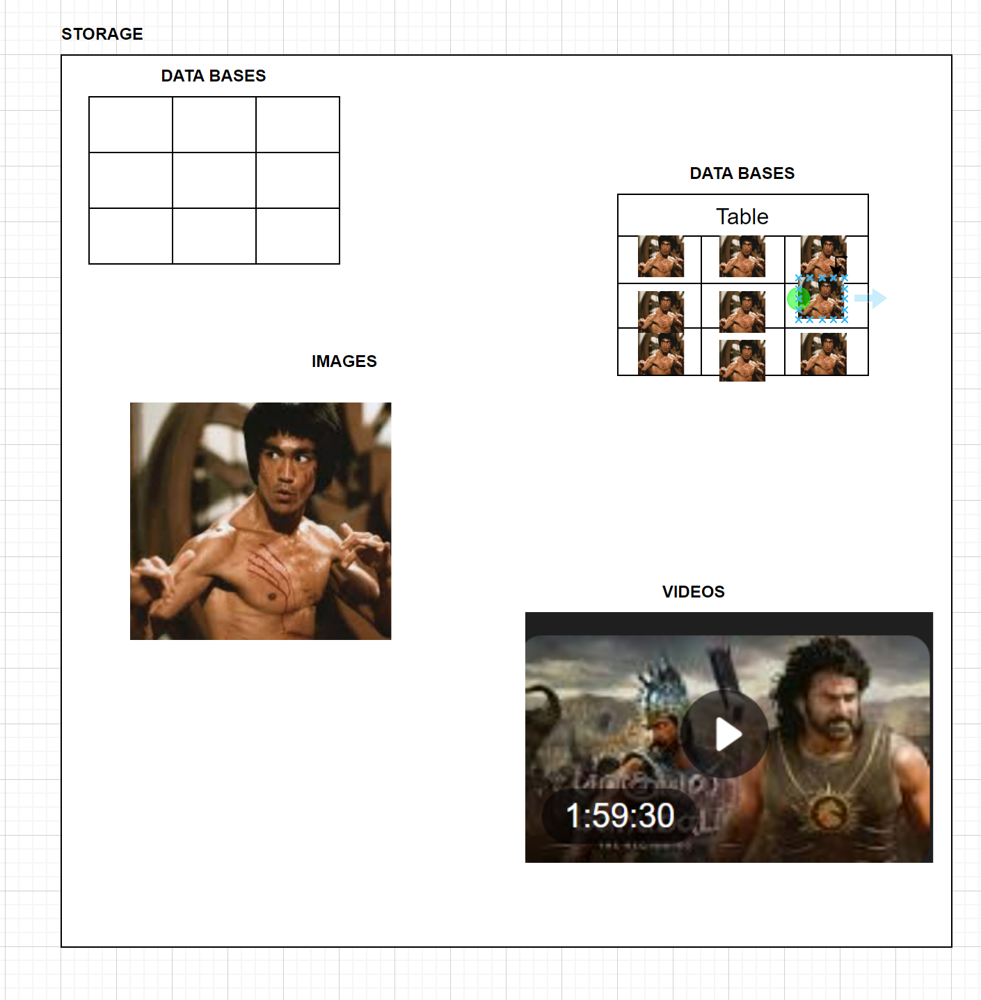

File system
----------------
### What is the difference between Storage, Database, Data?
**Storage**, **database**, and **data** are interconnected concepts, but each has a distinct role in computer systems:

**Storage:**

* **Physical space:** Storage refers to the physical devices used to store data, such as hard drives, solid-state drives (SSDs), and cloud storage.
* **No inherent structure:** Storage devices don't have a predefined structure for organizing data.
* **Direct access:** Data is accessed directly by the operating system or applications.

**Database:**

* **Structured data:** Databases organize data into tables, rows, and columns, with defined relationships.
* **Efficient access:** Databases use indexing and query optimization to quickly find and retrieve data.
* **Managed:** Database management systems (DBMS) are used to create, maintain, and access databases.
* **Typically stored on storage:** Databases often store their data on underlying storage devices.

**Data:**

* **Information:** Data is the raw information that is processed and stored. It can be in various forms, such as text, numbers, images, audio, or video.
* **Stored in storage:** Data is typically stored on storage devices.
* **Used by databases:** Databases organize and manage data for efficient retrieval and use.

**In summary:**

* **Storage** is the physical space where data is stored.
* **Database** is a structured collection of data that is organized for efficient access and management.
* **Data** is the raw information that is stored in storage and used by databases.

**Think of it like this:** Storage is the warehouse where you keep your belongings, a database is a library where those belongings are organized and cataloged, and data is the actual information contained in the belongings.
