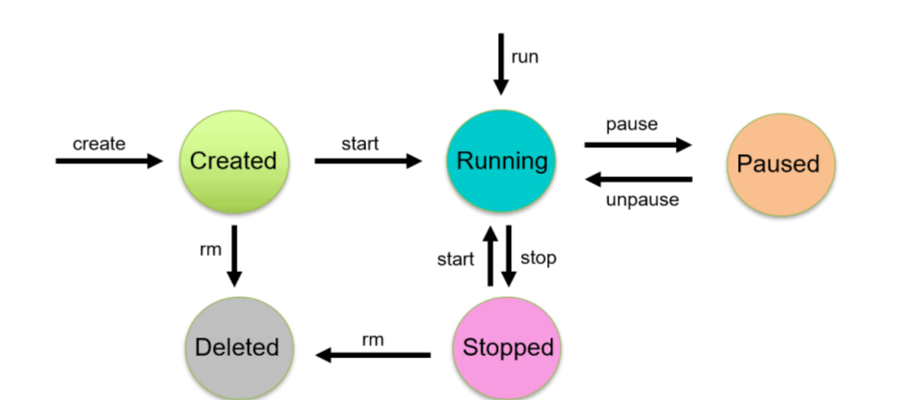

# Docker 
* docker looks for image locally
* if image present then container 
## Run nginx and tell what is background process
## Docker life cycle
* It consists of five states
  1. Created 
  2. Runnning 
  3. Pause
  4. Stopped/Exited
  5. Deleted

* Talk only about states and not about commands(run,create,rm etc.)
### What is the difference between Pause and stoped state?
* In Pause state process is not killed but in dormant mode
* In Stopped state process is killed and there is no any process.
* `-P` is dynamic port forwarding
* For `reactjs` application `nginx` is necessary to run the application
  * `nodejs` is required for the developing application.