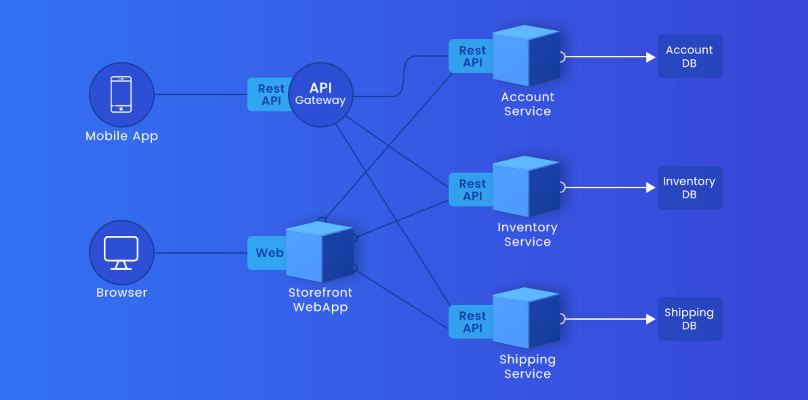

Running Notes 
--------------
# Python
* Lamda service: turn off the computer, when you log out
* Serverless Service: no need of servers
* code is run as function
## ctl+H
  ### Editors
  * Find and replace
  ###  Browsers
  * Getting history
# Multi-Cloud
* scale_up/ scale_down --> vertical scalling
* scale_in/scale_out --> horizontal scalling
* `htop`
* ` stress-ng --cpu 8 --cpu-method all --timeout 60 --metrics-brief`


## AWS
* AWS don't stop  we have to stop and do scale_up/ scale_down
  * ### Scaling Policies
    * Simple/Step scaling
    * Target Tracking policy
    * Predictive scaling
      * it requires atleast two days of monitering
* `target group == auto scaling group`
* In interviews we have to say about `zero downtime deployment` policy
### Cloudformation
* In cloudformation stack is necessary
* Stack is like resource group in Azure
* 


## Azure
* Compute Gallery
* Azure stop and do scale_up/ scale_down
* Virtual machine scale sets = Auroscaling groups
* for predictive scaling it requiers atlaeast 2 days of time
* `Application health monitering` == `Amazon Cloud Watch`

### Azure Resource Manager (ARM) templates
* ref(https://learn.microsoft.com/en-us/azure/templates/)
* variables = local.tf(terraform)
* parameters = user inputs
* Content versionn is like tags which you  have to pass
* resource provider = for every service we have  different providers
* resource name = compute, network


* #### fixed scaling
  * give no of machines and those no of machines are maintained
* `Target Group` = `backend target`
* `rules` = `listeners`
* `health checks` == `health probes`
* #### load balacer
  * paths
  * headers
  * domains
* sticky sessions
  * these are in both applicaion lb and network lb
* `backend == virtual machine scale sets`
# terraform
* In interviews you have to say that I did terrascan and looking for any vulnerability issues.
## Terraform cloud
* when ever you are using git use tags section for terraform
* terrascan 
* terraform unit tests(It is not that much importance)
* terraform cloud
# Docker
* in `docker container run -d -P --name akhil ak:1`
  * In this docker is the command line tool
# K8s 19/10/2024 Morning
* Lables can be applied to following objects of k8s for querrying
* Objects of k8s
  * Nodes
  * pods
  * replicasets
  * deployments
  * Daemonsets
  * Statefulsets
# Pod
* It is also like the name space that isolate the containers
## Daemonset
* Kubelet is nothing but Daemonset
* Kubeproxy is nothing but Daemonset
* For collecting logs from nodes Daemonsets are necessary
* Daemonsets is nothing but Agent kind of setup
* Daemonsets are helpfull in rollbacks and rollingupdates
## Statefulsets
* Difference between stateless and stateful
* stateless is nothing but applicaitons which store data generated by it on other data bases pod or data bases (frontend applications)
* stateful applications are nothing but store the data which is generated by it or other applications data(frontend applications)
* Generally statefulsets sets are nothing but pods with database applications like postgres, mysql etc.,
## Connecting to k8s cluster
  1. kubectl 
  2. client libraries(python, java)
* By using REST-API above two will connect with k8s server
## kubectl [command] [TYPE] [NAME] [flags]
###  Commands
* [refer_here](https://kubernetes.io/docs/reference/kubectl/)
* Only 4 types of commands in k8s
   1. create
   2. apply
   3. upgrade
   4. delete
   5. get
### TYPES
* kubectl api-resources
### NAMES
* Names that you give to resources which you are going to created 
### flags
* [refer-here](https://kubernetes.io/docs/reference/kubectl/generated/kubectl/) for flags
# 19/10/2024 K8s Evening 
* yaml and json is data representation in the format of key,value pair
* This is not scripting language but it is a data representation
* Files are of 3 types
  1. Human Readble
     1. Understandable by humans
  2. Machine Redble
     1. Understandable by machines
  3. Configaration files
     1. Understandable by both Humans and Machines
* Write the manifest based on server api version.
* To know the server version apply command 
```sh
kubectl version
```
## Commands for kubectl
```sh 
kubectl get pods <pod-name> -o yaml
kubectl get pods --help
kubectl get po -w # 'w' means watch
kubectl get pods --show-labels
```
## CrashsloopBackoff
* k8s tries to restart the container when it goes to exited state
* If it continously failing then we see CrashsloopBackoff error.
## Init containers
* We have web application and db appliction
* init containers are created in application pod 
  * Don't start application container untill db pod is created
  * For the checking purpose we use init containers
  * Init containers goes to exited stated when db pod got start
  * After init containers goes to exited state, main container (application container) starts working.
# 20/10/2024 K8s Morning
* 
## requests and limits
* requests - lower limit
* limits - upper limit
* we can put requests and limits to cpu, memory, disks(storage)
* putting upper limits (limits) are mandatory
* we can describe these at container level spec
## Replicaset
* Replica set can create pods based on labels
    * If already 5 pods are there with env: "dev" and we specify 5 replicas in spec with labels env: "dev", replicaset can not create pod
    * replicaset consider labels it can not mind who create pods
    * It considers only labels and maintain no of pods of that number
* Thats why it comes under controller section
* It always moniters required pods are there or not
```sh
matchLabels:
  app: dev
  env: dev
# in this "app and env"  not "app or env", both should present
```
## service
* Inside K8s we have DNS server this is called CORE DNS.
* This gives unique names to ip addresses
```sh
selector:
  app: dev
  env: dev
# in this "app or env" any one is enough
```
### clusterip (kubeadm and managed k8s)
### Nodeport (kubeadm)
* we have to range of nodeport range 30000-32767
### Load Balancer(managed k8s)
* This is available for cloud based cluster aws or azure
# 20/11/2024 K8s Evening
* 
## Managed K8s cluster
### Node Pools
* These are nothing but collection of different os vm machines
  1. Node Pool1 - all linux VM's are in this pool
  2. Node Pool2 - all windows VM's are in this pool
* what are node pools in azure?
* what is meant by cloud controller manager?
* CNI of aks is managed by azure CNI
    ### Advantages
        * Through this azure CNI different azure services can be connected
        * K8s cluster, Data bases, roles etc,. are all in the same network and are able to communicate with each other
* cat /var/logs/cloud-init
### In 3 tier architecture 
1. Frontend
   1. APP
   2. Web (browsers)
2. Backend
3. Data Base
#### Frontend
* APP will directly speak with api to communicate with backend
* Web will speak with store frontend and store frontend will speak with api to communicate with backend

# 22/10/2024 K8s 
## Deployments
* it gives zero downtime approach
* atleast one pod is running
* It is for stateless applications
# 24/10/2024
## Daemonset
* In Daemonset spec there is no any `replicas` section
# 26/10/2024 K8s 
# Lens
* UI viewing of aks cluster
# Ingress
* rewright in ingress
* annotations are used to communicate with third party services
* default backend
* vertical pod auto scalling is usefull for recommendations suggetions
    * defaultly put it to `off`
* In Production environment we should have network policies
* In other environments that is not that much importance
# 02/11/2024 K8s
* Pod preset [refer_here](https://kubernetes-docsy-staging.netlify.app/docs/concepts/workloads/pods/podpreset/) this is not that much importance
* in the world of helm we have charts
# Helm
* Manifest-> template -> valu
* makesure to know about loops and if-conditions in helm cheat sheet
*` github kustomize example` search it in google
# 09/11/24 k8s 
* If system fails in production the solution is rollbacks for devops engineers
* Google four golden signels(These are used for troubleshooting the problems for any thing in DevOps)
    1. Latency
    2. Traffic
    3. Error
    4. Saturation
### Site Reliability Engineer
* SLI
* SLA
* SLO
## Observebility
* Logs  
* Traces 
* Metrics
## 
* Loki collects logs 
* Prometheus collects metrics 
* Graffana is used to see logs and metrics from Loki and Prometheus
## Terminology regarding Observebility (interview)
* Service Mesh
* Sidecar for collecting logs 
* How to collect application metrics, logs, traces?
* Opentelemetry 
* log collection using sidecars are important
* exporters
* kubectl->helm->argoCD(Transformation)
# 30/11/2024
* Codelint and codeql
* SCA and SAST
* Dast
* Attack surface and attack vector, os hardening
* Injection Attacks
* Interview questions for k8s
* which problems do you face recently?
    * what is the problem?
    * how you troubleshoot it?
    * what are preventions for potential threats?
# 1/12/2024
* SCA(Software composition analysis)
    * Dependencies
* SAST(Static application security testing)
    * testing Code developed or written
* DAST(Dynamic application security testing)
    * testing at application running time 
* what is CVE in security issues?
* OWASP
* OWASP web top 10 attack list?
* restapi
* what are popular sast tools?
* contaninerized
* free tools
    * snyk
* App Registration and client id, service principle 
# 3/12/2024
## DevOps
* In azuredevops pipeline we don't need to define to clone the repository 
    * by default it clones the repo
## Cloud

# 4/12/2024
## DevOps
  ### Self Hosted Agnet
    * In self hosted agents installing necessary softwares using the pipeline scripts is not good practice
      * If you are working with pipeline we are assuming that all necessary softwares are present in agent
  ### Microsoft hosted agents
    * Microsoft hosted agent all necessary softwares are managed by microsoft and we don't need to worry about that.
### Integrate these into your github actions (CICD)
  * code quality checks 
  * lint checks
* git branching strategies are important and explained in the class, see it once
## Multi cloud
  ### AWS
   * NACL policy type is allow list and deny list
       * if a thing has both allow and deny, according to priority number it works
   * Security Group has only allow list
       * any thing other than allow is by default deny
     * `*` means lowset priorirty
  ### Azure 
    * here we have only `Network security group ` which has both allow and deny rules and can be applied at both network interface level and subnet level.
    * It has both allow and deny rules
    * lower the number and higher the prioroty
# 07/12/2024
* If the same template is using 4 projects (azure devops)
    * The advantage is if any issue is there, it can be fixed at template and all the 4 projects were set.
* In template section type git means azure devops source repository
# 7/12/2024
* In azure devops templates section variables are used for sensitive information.
* If there is any user defined values then  parameters are used
* All the DevOps engineers handles the release branch
# 8/11/2024
* 