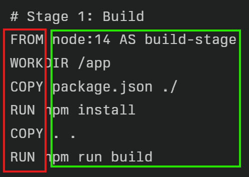
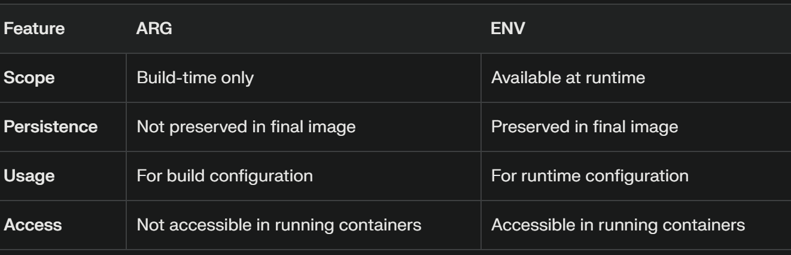
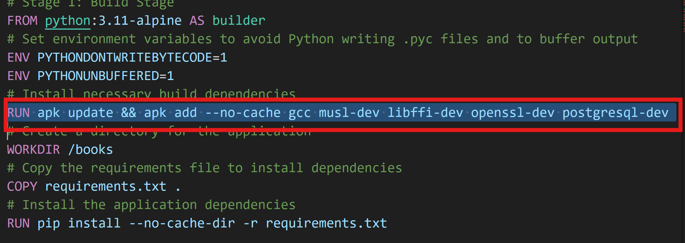

Docker Concepts
-----------------
## Dockerfile
* Docker is text based file
* First Column is called `instructions`, in the second cloumn we give `values`

* VAR is build time variable
* ENV is runtime variable

## Running the application manually by the reference of Dockerfile
* In Dockerfile we see commands like this

  ### Alpine Package Keeper
  * APK is used to manage software packages within Alpine Linux. It allows you to install, update, and remove packages.
  In Dockerfiles, you often see commands like RUN apk add --no-cache <package> to install necessary software packages without caching the package index, which helps keep the image size small.
  * For ubuntu we have package manager called `apt-Advanced Package Tool`